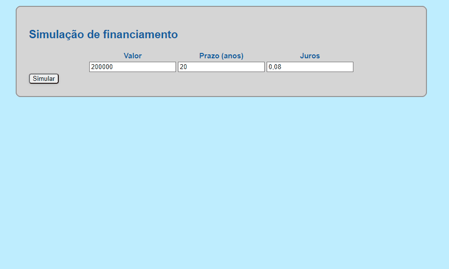

# Simulador de financiamento SAC

Este projeto é o primeiro desafio do curso do Bootcamp da IGTI em parcecia com o Banco Pan, o Tech Pan. Tem como funcionalidade simular um financiamento SAC, mostrando os Juros, amortização e total pago das 5 primeiras parcelas. Foi criado utilizando HTML, CSS, JavaScript e DOM. 

## Melhorias Futuras:
- Clean code
- Dispobilizar todas as prestações
